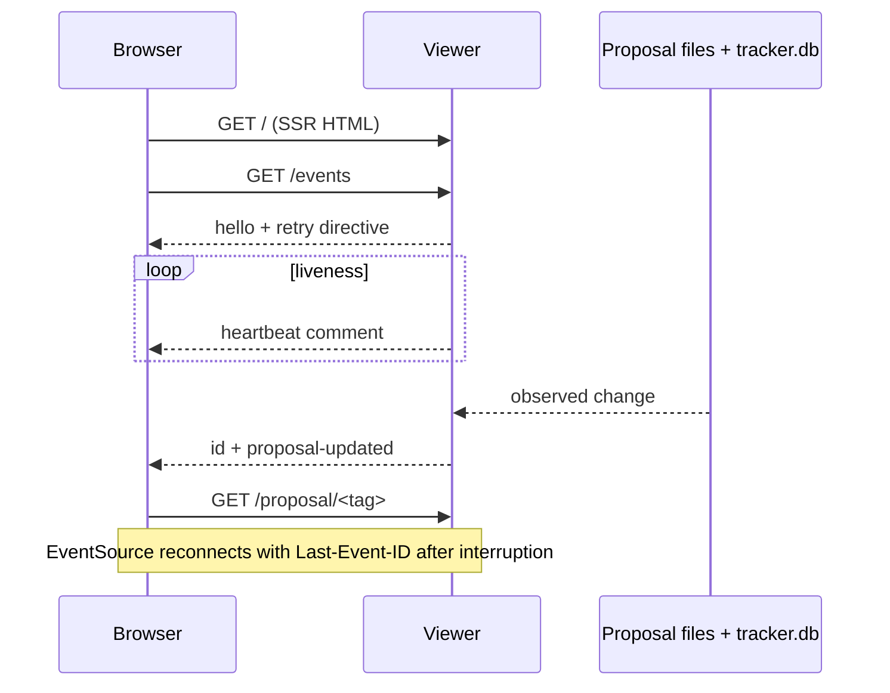

# SSE liveness and resume for the proposal viewer

## RFC status

Pending human review. This paper proposes adopting and hardening the current SSE experiment; it does not authorize further implementation until approved.

## Problem and scope

### Problem

The server-rendered proposal viewer can become stale while a CLI process, another browser, or a reviewer changes a proposal. A reviewer also needs a visible signal that the server is alive, and a transient network failure should not require a manual page refresh.

### Scope

Add one browser-owned Server-Sent Events connection to every viewer page. The connection reports liveness, delivers proposal-change notifications, and resumes from the browser-provided `Last-Event-ID` after reconnecting. The page reloads its SSR document after a change so the rendered proposal remains the source of truth.

### Non-goals

- Replacing SSR with a client-side application.
- Using SSE as an authentication or authorization boundary.
- Providing cross-process or post-restart event durability in this component.
- Streaming proposal contents or human comments as partial patches.
- Turning a reviewer action into automatic implementation.

## Context and evidence

The current repository contains the viewer and an experimental SSE implementation in:

- `.agents/skills/paper-proposals/scripts/paper-proposals.js`
- `.agents/skills/paper-proposals/SKILL.md`
- `proposals`, the repository entrypoint used to start the viewer

The prototype currently:

- serves `GET /events` as `text/event-stream` on localhost;
- emits `hello`, `proposal-updated`, and heartbeat comments;
- uses `EventSource`, `Last-Event-ID`, and an in-memory history of up to 100 events;
- watches tracker/state/proposal/message file changes once per second; and
- reloads the page after `proposal-updated`.

Evidence recorded during incubation: an SSE client received `hello`, a proposal change produced `proposal-updated`, and a reconnect carrying `Last-Event-ID: 1` received the subsequent event and `resumedFrom: 1`. This is prototype evidence, not approval or production proof.

## Proposed design

### Lifecycle



The viewer owns the event connection. The server owns event IDs and the connected-client registry. A one-second watcher compares the indexed proposal state plus relevant file modification times; a difference creates one coalesced `proposal-updated` event for all clients. The browser then performs a normal GET and does not attempt to merge partial document state.

### Event contract

Every named event has a monotonically increasing integer `id` for the lifetime of the viewer process:

```text
retry: 1000

id: <id>
event: hello
data: {"alive":true,"resumedFrom":<last-event-id>}

id: <id>
event: proposal-updated
data: {"at":"<ISO-8601 timestamp>"}
```

Heartbeat comments (`: alive <epoch-ms>`) have no event ID and must not advance resume state. The server retains a bounded in-memory replay window. If the requested ID is older than that window, the server sends `hello` with the current position; the client performs a full SSR reload on the next update rather than assuming it has every intermediate event.

### Browser behavior

- `onopen` marks the server connected.
- `onerror` marks the server reconnecting and leaves `EventSource`’s native retry behavior active.
- `hello` confirms that the connection reached the current server process.
- `proposal-updated` marks an update received, then reloads the current URL.
- The page does not submit review decisions through SSE; review and discussion remain ordinary POST requests.

### Ownership and boundaries

The event layer owns liveness, event numbering, replay-window management, watcher scheduling, and stream cleanup. The proposal store remains the source of truth for content and state. The SSR renderer owns the final HTML. The browser owns reconnect timing through `EventSource`, bounded by the server’s `retry` hint.

### Failure behavior

- If the viewer process stops, the browser displays reconnecting and retries; no post-restart event history is promised.
- If an event is missed beyond the replay window, a subsequent notification causes a complete SSR reload.
- If a proposal disappears or is malformed, the existing 404/error rendering remains authoritative.
- If many filesystem changes occur during one watcher interval, they collapse into one update notification; the subsequent GET observes the final state.
- A disconnected client must be removed and its heartbeat timer cleared.

## Interfaces and invariants

### HTTP

- `GET /events` returns `200 text/event-stream; charset=utf-8`.
- The response includes `Cache-Control: no-cache` and keeps the connection open.
- The endpoint is bound to `127.0.0.1` by default with the existing viewer.
- `Last-Event-ID` is treated as an opaque non-negative cursor after validation; invalid values fall back to the current position.

### Invariants

1. Event IDs increase strictly within one viewer process.
2. Heartbeats never represent proposal state and never advance the event cursor.
3. An SSE notification never claims that a particular proposal revision was delivered; the following SSR GET is authoritative.
4. Closing a stream releases its heartbeat timer and client entry.
5. No event endpoint mutation is introduced; review/comment writes remain governed by the existing human review path.

## Validation criteria

### Deterministic local validation

- Start the viewer with `./proposals` and verify the index contains the live connection indicator.
- Connect with `curl -N /events` and observe `retry`, `hello`, and heartbeat output.
- Create or modify a proposal through the CLI while the viewer is open; observe one `proposal-updated` event and refreshed HTML.
- Disconnect and reconnect with the prior `Last-Event-ID`; verify only later events replay and `hello.resumedFrom` reports the cursor.
- Connect multiple clients and verify each receives the same update.
- Stop the server and verify the browser reports reconnecting; restart it and verify a new `hello` rather than a false claim of durable history.
- Verify a closed client no longer receives heartbeats or events and the process does not accumulate timers.

### Evidence boundaries

These checks prove local process and browser behavior only. They do not prove reverse-proxy buffering, public exposure, multi-process coordination, authentication, deployment behavior, or restart durability.

## Execution notes

This paper is self-contained and has no prerequisite paper. Implementation can proceed as one viewer slice after approval. A later durability paper may depend on this one if restart-safe replay or a persistent event cursor becomes necessary. No parallel implementation is proposed for this component because the browser contract and server transport must be validated together.

## Risks, alternatives, and open decisions

### Risks

- In-memory replay history is lost on restart.
- A one-second watcher adds periodic filesystem/database work.
- Localhost-only binding does not protect a deployment if the viewer is later reverse-proxied.
- Reloading the full document may interrupt unsent local form input.

### Alternatives considered

- Polling: simpler, but less immediate and gives a weaker liveness signal.
- WebSocket: bidirectional capability is unnecessary for server-to-browser notifications.
- Persistent event log: stronger resume semantics, but expands the storage and migration surface.
- Client-side patch protocol: lower reload cost, but duplicates SSR rendering and validation logic.

### Open decisions

- Should the watcher interval and replay-window size be configurable?
- Should a future reverse-proxied deployment require an explicit authentication/CSRF design before enabling the endpoint?
- Is post-restart replay a real requirement, or is full SSR refresh after reconnect sufficient?
- Should unsaved form state be preserved before an automatic reload?
