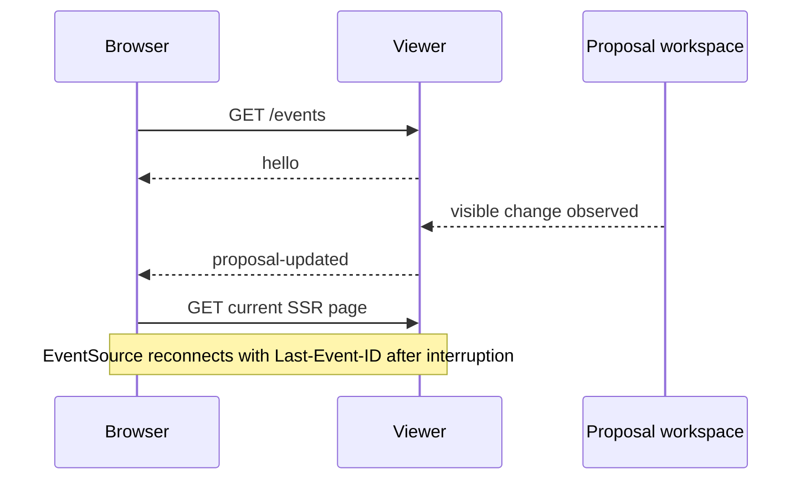

# SSE update notification for the proposal viewer

## Status

This is a revision of the rejected submission. It requests human review only; it does not authorize implementation.

## Problem and scope

The server-rendered proposal viewer can become stale when another CLI process, browser, or reviewer changes a proposal. The viewer needs a browser-reconnectable notification channel so it can request a fresh SSR document.

This proposal covers one server-to-browser SSE channel and the subsequent full-page reload. It does not change proposal storage, review authority, or the Markdown document format.

## Requirements

The design MUST:

1. notify open viewer pages after a proposal-visible change;
2. allow the browser to reconnect using the standard `Last-Event-ID` mechanism;
3. keep the proposal document and review state authoritative in the existing SSR response;
4. avoid exposing review or discussion writes through SSE; and
5. remain useful when the viewer process restarts, without claiming durable event history.

The design SHOULD coalesce changes observed during one watcher interval into one notification.

## Non-goals

- replacing SSR with a client-side application;
- streaming proposal contents or comments as patches;
- authenticating or authorizing a reviewer;
- guaranteeing replay across a viewer-process restart; or
- changing the human approval workflow.

## Proposed design

The viewer exposes `GET /events` as an SSE response. Each browser page opens one `EventSource`. A server-side watcher observes the existing proposal workspace and publishes one `proposal-updated` event when the rendered data may have changed. The browser then performs a normal GET for its current URL.



### Event contract

The response MUST use `text/event-stream; charset=utf-8` and MUST remain open while the client is connected.

Named events have monotonically increasing integer IDs for the lifetime of one viewer process:

```text
retry: 1000

id: 12
event: hello
data: {"alive":true}

id: 13
event: proposal-updated
data: {"at":"2026-09-29T00:00:00.000Z"}
```

Heartbeat comments MAY be sent to keep an idle connection active. A heartbeat MUST NOT advance the event ID.

The server MAY retain a bounded in-memory replay window. On reconnect, it MUST replay events newer than the supplied `Last-Event-ID` when those events remain available. It MUST NOT claim that events older than the replay window were delivered. A reconnect after process restart starts a new in-memory event sequence and requires a normal SSR request to establish current state.

### Ownership

- The viewer owns connection registration, event IDs, replay-window handling, and stream cleanup.
- The proposal workspace remains the source of truth.
- The SSR renderer remains responsible for the complete page.
- The browser owns reconnection through the native `EventSource` behavior.

## Interfaces and invariants

- `GET /events` is read-only.
- Review and discussion writes continue through their existing ordinary POST paths.
- A `proposal-updated` event means “the current page may be stale”; it MUST NOT identify a specific revision as delivered.
- Event IDs increase strictly within one viewer process.
- Closing a stream removes its client registration and heartbeat timer.
- The endpoint remains bound according to the viewer’s existing server binding; public exposure is outside this proposal.

## Repository evidence

The relevant current entry points are:

- `cli/paper-proposals.js`, the Bun CLI and SSR viewer;
- `proposals`, the repository command wrapper; and
- `.agents/paperwork/proposals/`, the proposal workspace.

This paper does not treat the current implementation as production proof. Browser, proxy, deployment, and restart behavior require the validation below.

## Validation criteria

After implementation, the following local checks MUST pass:

1. `GET /events` returns the declared content type and an initial `hello` event.
2. A proposal or message change produces one `proposal-updated` event and a subsequent SSR GET contains the changed content.
3. Reconnecting with a recent `Last-Event-ID` receives only newer retained events.
4. Heartbeat comments do not advance the event ID.
5. Multiple connected browsers receive the same update notification.
6. Closing a client stops its heartbeat and removes it from the client registry.
7. Restarting the viewer does not claim replay of the previous process’s events; a fresh SSR GET still shows current workspace state.

These checks do not prove reverse-proxy buffering, authentication, multi-process coordination, or durable replay.

## Execution and dependencies

This is one viewer transport slice with no prerequisite paper. Implementation MUST remain behind human approval. No parallel implementation is proposed because the server event contract and browser reconnect behavior must be validated together.

## Risks and open decisions

The in-memory replay window is lost on restart. Full-page reloads may interrupt unsent form input. Filesystem watching adds periodic local work.

Human review is requested on two bounded decisions:

1. What replay-window size is appropriate for the local viewer?
2. Should unsaved message-editor text be preserved before an automatic reload?
