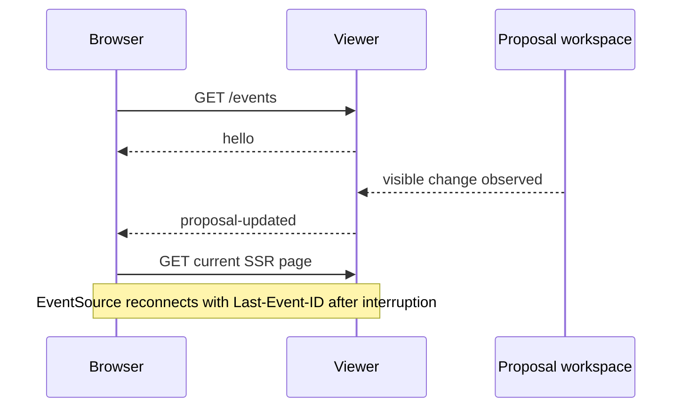

# SSE update notification for the proposal viewer

## Problem and scope

The server-rendered proposal viewer can become stale when another CLI process, browser, or reviewer changes a proposal. The viewer requires a server-to-browser notification channel that causes a fresh SSR request without moving proposal content into client-owned state.

This paper defines the SSE channel and its reconnect behavior. It does not change proposal storage, review authority, Markdown format, or write endpoints.

## Requirements

The viewer MUST:

1. notify open pages after a proposal-visible change;
2. use the browser’s `Last-Event-ID` reconnect mechanism;
3. treat the next SSR response as authoritative for content and state;
4. keep review and discussion writes outside SSE; and
5. remain correct after a viewer-process restart without claiming durable replay.

Changes observed during one watcher interval MUST produce at most one notification for that interval.

## Non-goals

- replacing SSR with a client-side application;
- streaming proposal contents or comments as patches;
- authenticating or authorizing reviewers;
- replaying events across a viewer-process restart; or
- changing the human approval workflow.

## Proposed design

The viewer exposes `GET /events` as an SSE response. Each page opens one `EventSource`. A watcher observes the existing proposal workspace and emits `proposal-updated` when the rendered data may have changed. The browser reloads its current URL with a normal GET.



### Event contract

`GET /events` MUST return `200 text/event-stream; charset=utf-8`, remain open while connected, and include `Cache-Control: no-cache`.

Named events use strictly increasing integer IDs for one viewer-process lifetime:

```text
retry: 1000

id: 12
event: hello
data: {"alive":true}

id: 13
event: proposal-updated
data: {"at":"2026-09-29T00:00:00.000Z"}
```

Heartbeat comments MAY be sent every 15 seconds. They MUST NOT advance the event ID.

The viewer retains the latest 100 named events in memory. A reconnect with `Last-Event-ID` replays retained events with larger IDs. A cursor older than the retained window receives no historical guarantee; the browser establishes current state with its normal SSR GET. A process restart discards the window and starts a new event sequence.

The browser reloads after `proposal-updated`. Before reloading, it stores the message editor’s unsent text in `sessionStorage` under a key derived from the current proposal URL and restores it on the next page load. Submitted messages clear that value. This preserves reviewer input while keeping SSR authoritative.

## Interfaces and invariants

- `GET /events` is read-only.
- Review and discussion writes continue through ordinary POST paths.
- `proposal-updated` means only that the current page may be stale; it does not identify a delivered revision.
- Event IDs increase strictly within one viewer process.
- Heartbeats do not advance the cursor.
- Closing a stream removes its client registration and heartbeat timer.
- The endpoint uses the viewer’s existing server binding; public exposure is not part of this decision.

## Repository context

The relevant entry points are `cli/paper-proposals.js`, `proposals`, and `.agents/paperwork/proposals/`. The proposal workspace remains the source of truth for documents, revisions, messages, and review state.

## Validation criteria

The implementation MUST demonstrate locally that:

1. `GET /events` returns the declared content type and an initial `hello` event;
2. a proposal or message change produces one `proposal-updated` event and a following SSR GET contains the change;
3. reconnecting with a recent cursor receives only newer retained events;
4. heartbeat comments do not advance the cursor;
5. multiple clients receive the same notification;
6. closing a client clears its heartbeat and registration;
7. a restart makes no claim about old events while a fresh SSR GET shows current workspace state; and
8. unsent message-editor text survives an automatic reload and is cleared after successful submission.

These checks do not establish reverse-proxy buffering, authentication, multi-process coordination, or durable replay.

## Execution

This is one viewer transport decision with no prerequisite paper. The event contract, reconnect behavior, and editor-preservation behavior are one acceptance boundary and MUST be validated together.

## Risks and alternatives

The bounded in-memory window cannot provide durable replay. Full-page reloads still discard other unsaved page state. `sessionStorage` preserves text only within the same browser session and may retain stale text after an abnormal exit.

Polling would reduce connection complexity but would provide slower change notification. WebSocket would add bidirectional capability not required by this decision. A persistent event log would provide stronger replay but would expand storage and migration scope.
